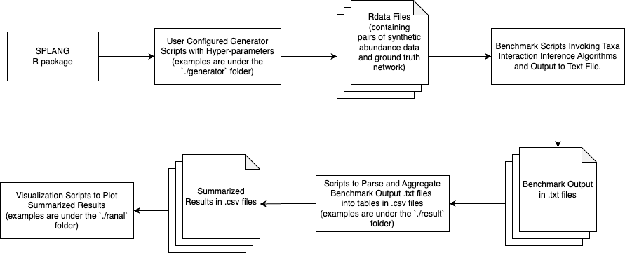

# Example Workflow Using SPLANG as a Testbed for Microbial Interaction Inference Algorithms

SPLANG is a **s**ynthetic **P**oisson-**l**ognormal-based **a**bundance and **n**etwork **g**enerative model that extends the work from (Chiquet et.al 2019) by enabling the expression of asymmetric taxa interactionand can generate synthetic abundance sampling data along with the underlyingtaxa interaction network.

SPLANG focuses on generating synthetic abundance sampling data along with the underlying taxa interaction network. It is implementation as a R package, which can be installed via the`devtools` [R package](https://cran.r-project.org/web/packages/devtools/index.html) through [this public GitHub repository](https://github.com/Quar/SPLANG). 

This example workflow demonstrates one possible approach to using SPLANG as a testbed. The example scripts may require adaptation depending on the local setup. While further enhancements, such as path configurations and dockerization, are possible, they fall outside the scope of this example workflow.

## Data Flow

